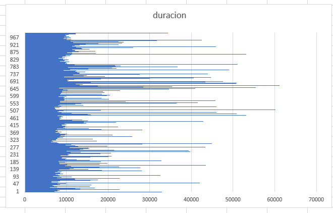
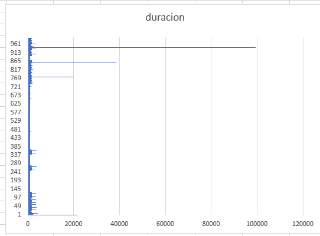
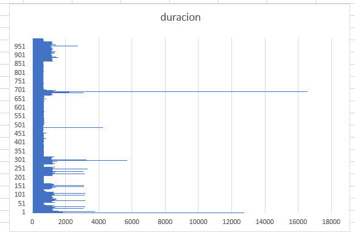
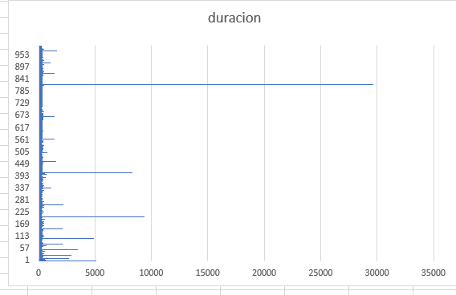
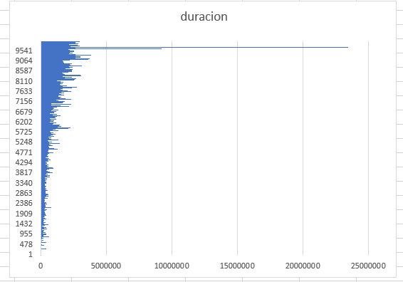
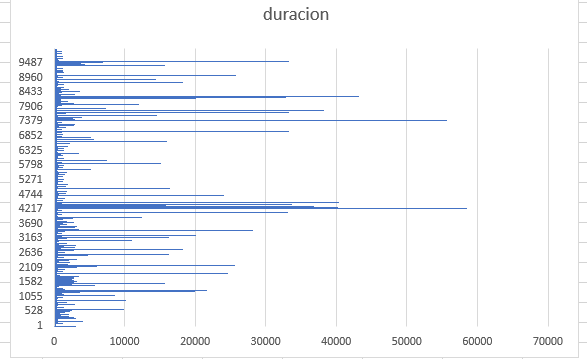
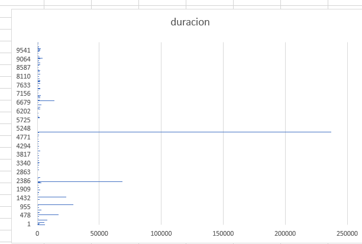
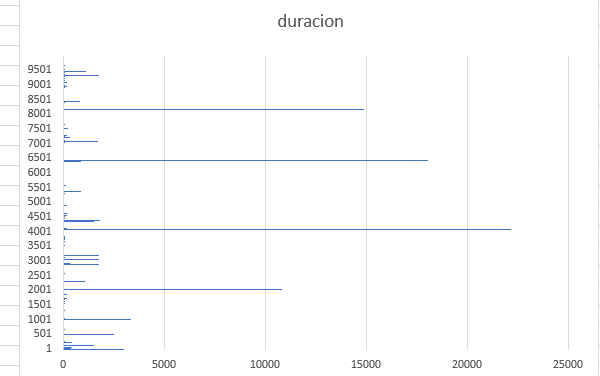

1- Insertar en desorden los nodos del arbol

2- Insertar desorden set

3- Insertar desorden unset

4- Insertar desorden vector

5- Insertar orden arbol

6- Insertar orden set

7- Insertar orden unset

8- Insertar orden vector

Resultados observados:

- Guardar los datos en desorden toma menos tiempo que guardarlos en orden.

- Los datos guardados en un arbol de manera ordenada, son los que presentan una mayor duracion.

- La duracion de guardar los datos en un vector es similar, ya sea en orden o desorden.

Nota: 
- Solo se muestran estos graficos ya que los otros no se pudieron ejecutar por segmentation fault.
- Operaciones total = 1000
- Batch = 100

